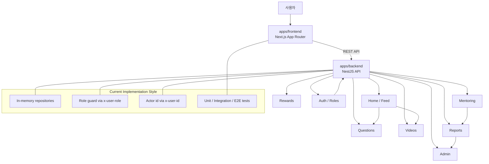

# KeepIt

KeepIt은 고등학생 대상 질문-답변 학습 커뮤니티입니다. 사용자는 질문을 올리고, 텍스트 또는 영상으로 답변을 받으며, 이후 멘토링과 운영 기능으로 확장됩니다.

## 애플리케이션 개요

KeepIt 워크스페이스는 다음 두 애플리케이션으로 구성됩니다.

- `apps/backend`: NestJS 기반 API 서버
- `apps/frontend`: Next.js 15 App Router 기반 웹 클라이언트

핵심 기능은 다음과 같습니다.

- 홈 피드에서 영상과 질문을 함께 노출
- 질문 작성, 답변 작성, 신고 기능 제공
- 관리자 대시보드에서 신고 큐와 SLA 상태 확인
- 역할 기반 UI로 학생, 멘토, 관리자 화면을 구분

## 전체 아키텍처 다이어그램



## 시작하기

1. 저장소를 연 다음 `apps/backend`와 `apps/frontend`를 각각 별도 프로젝트로 다룹니다.
2. 각 앱에서 의존성을 설치합니다.
3. 백엔드 API를 먼저 실행한 뒤 프론트엔드를 실행합니다.

루트 `scripts/` 폴더의 실행 파일을 사용하면 더 편리합니다.

- `scripts/run-all.sh`: 백엔드와 프론트엔드를 한 번에 실행
- `scripts/test-all.sh`: 백엔드와 프론트엔드 테스트를 한 번에 실행
- `scripts/tdd-cycle.sh`: TDD 사이클용 테스트(단위/통합/E2E)를 대상별로 실행

## 사전 개발 환경 요구사항

- Node.js 20 이상 권장
- npm 10 이상 권장
- macOS, Windows, Linux 중 하나
- Git
- Next.js와 NestJS 실행을 위한 터미널 환경

## 환경변수 설정

### 백엔드

```bash
cd apps/backend
cp .env.example .env
```

필수 주요 값:

- `GOOGLE_CLIENT_ID`
- `GOOGLE_CLIENT_SECRET`
- `GOOGLE_CALLBACK_URL`
- `FRONTEND_BASE_URL`
- `GOOGLE_ADMIN_EMAILS` (쉼표 구분 이메일 목록)

### 프론트엔드

```bash
cd apps/frontend
cp .env.example .env.local
```

주요 값:

- `NEXT_PUBLIC_API_BASE_URL`

## 애플리케이션 실행하기(로컬)

### 백엔드

```bash
cd apps/backend
npm install
npm run start:dev
```

기본적으로 백엔드 API는 로컬 개발 서버에서 실행됩니다.

### 프론트엔드

```bash
cd apps/frontend
npm install
npm run dev
```

프론트엔드는 백엔드 API 주소를 환경변수 `NEXT_PUBLIC_API_BASE_URL`로 연결할 수 있으며, 기본값은 로컬 API를 사용하도록 구성합니다.

## 애플리케이션 배포하기(Azure)

추후 작성.

## 애플리케이션 테스트하기

### 백엔드 테스트

```bash
cd apps/backend
npm run test:unit
npm run test:integration
npm run test:e2e
npm run test:all
```

### 프론트엔드 테스트

```bash
cd apps/frontend
npm run test:unit
npm run test:integration
npm run test:e2e
npm run test:all
```

### 프론트엔드 빌드 검증

```bash
cd apps/frontend
npm run build
```

## TDD 개발 모드

워크스페이스에는 TDD 서브에이전트와 자동 테스트 자산이 포함되어 있습니다.

- 에이전트 정의: `.github/agents/`
	- `tdd-red.agent.md`
	- `tdd-green.agent.md`
	- `tdd-refactor.agent.md`
	- `tdd-orchestrator.agent.md`
- CI 테스트 매트릭스: `.github/workflows/tdd-test-matrix.yml`

로컬에서 TDD 테스트 사이클 실행:

```bash
bash scripts/tdd-cycle.sh backend
bash scripts/tdd-cycle.sh frontend
bash scripts/tdd-cycle.sh all
```

## 참고 문서

- [ARCHITECTURE.md](ARCHITECTURE.md)
- [PRD.md](PRD.md)
- [IDIA.md](IDIA.md)

## 작업 디렉터리

- `apps/backend`: 서버 API와 테스트
- `apps/frontend`: 웹 UI와 프론트 테스트
- `작1`: 초기 산출물 보관 폴더
