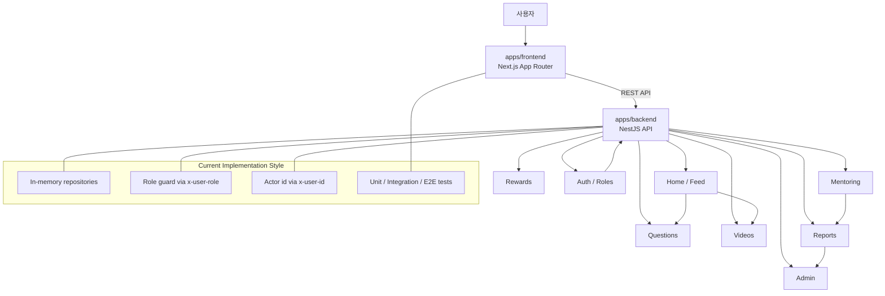

# KeepIt

KeepIt은 고등학생 대상 질문-답변 학습 커뮤니티입니다. 사용자는 질문을 올리고, 텍스트 또는 영상으로 답변을 받으며, 멘토링과 운영 기능으로 학습 경험을 확장할 수 있습니다.

## 프로젝트 구성

KeepIt 워크스페이스는 2개 앱으로 구성됩니다.

- `apps/backend`: NestJS 기반 API 서버
- `apps/frontend`: Next.js 15 App Router 기반 웹 클라이언트

## 핵심 기능

- 홈 피드에서 영상과 질문을 함께 노출
- 질문/답변/신고 흐름 제공
- 관리자 대시보드에서 신고 큐와 SLA 상태 확인
- 역할 기반 UI로 학생/멘토/관리자 화면 분리

## 아키텍처



## 개발 환경 요구사항

- Node.js 20+
- npm 10+
- Git
- macOS / Windows / Linux

## 빠른 시작

1. 저장소를 클론하고 워크스페이스를 엽니다.
2. 백엔드와 프론트엔드 의존성을 설치합니다.
3. 환경변수를 설정합니다.
4. 백엔드 → 프론트엔드 순서로 실행합니다.

### 1) 의존성 설치

```bash
cd apps/backend && npm install
cd ../frontend && npm install
```

### 2) 환경변수 설정

백엔드:

```bash
cd apps/backend
cp .env.example .env
```

주요 값:

- `GOOGLE_CLIENT_ID`
- `GOOGLE_CLIENT_SECRET`
- `GOOGLE_CALLBACK_URL`
- `FRONTEND_BASE_URL`
- `GOOGLE_ADMIN_EMAILS` (쉼표 구분 이메일 목록)

프론트엔드:

```bash
cd apps/frontend
cp .env.example .env.local
```

주요 값:

- `NEXT_PUBLIC_API_BASE_URL`

### 3) 로컬 실행

백엔드:

```bash
cd apps/backend
npm run start:dev
```

프론트엔드:

```bash
cd apps/frontend
npm run dev
```

## 루트 스크립트

루트 `scripts/`로 백엔드/프론트를 한 번에 다룰 수 있습니다.

- `scripts/run-all.sh`: 백엔드 + 프론트 동시 실행
- `scripts/test-all.sh`: 백엔드 + 프론트 테스트 실행
- `scripts/tdd-cycle.sh`: TDD 사이클(단위/통합/E2E) 실행

## 테스트

### 백엔드

```bash
cd apps/backend
npm run test:unit
npm run test:integration
npm run test:e2e
npm run test:all
```

### 프론트엔드

```bash
cd apps/frontend
npm run test:unit
npm run test:integration
npm run test:e2e
npm run test:all
```

### 프론트엔드 빌드 검증

```bash
cd apps/frontend
npm run build
```

## TDD 개발 모드

워크스페이스에는 TDD 서브에이전트와 CI 자산이 포함되어 있습니다.

- 에이전트 정의: `.github/agents/`
  - `tdd-red.agent.md`
  - `tdd-green.agent.md`
  - `tdd-refactor.agent.md`
  - `tdd-orchestrator.agent.md`
- CI 테스트 매트릭스: `.github/workflows/tdd-test-matrix.yml`

로컬 TDD 사이클 실행:

```bash
bash scripts/tdd-cycle.sh backend
bash scripts/tdd-cycle.sh frontend
bash scripts/tdd-cycle.sh all
```

## Azure 배포

Azure 배포 가이드는 현재 정리 중입니다.

## 참고 문서

- [ARCHITECTURE.md](ARCHITECTURE.md)
- [PRD.md](PRD.md)
- [IDIA.md](IDIA.md)

## 디렉터리

- `apps/backend`: 서버 API 및 테스트
- `apps/frontend`: 웹 UI 및 프론트 테스트
- `작1`: 초기 산출물 보관 폴더
